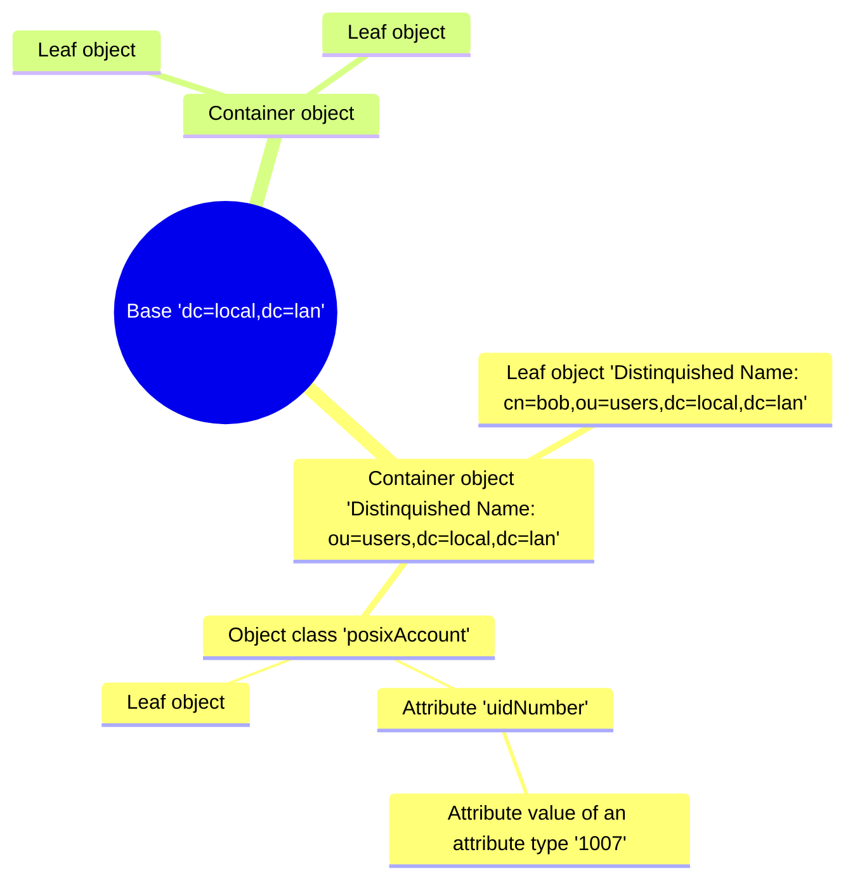

**L**ightweight **D**irectory **A**ccess **P**rotocol. An LDAP server basically is a non-relational database which is optimised for accessing, but not writing, data. It is mainly used as an address book (for e.g. email clients) or authentication backend to various services (such as Samba, where it is used to emulate a domain controller, or Linux system authentication, where it replaces /etc/passwd) and basically holds the user data.

## Schematic structure

```bash
objectclass (
    1.3.6.1.1.1.2.0
    NAME 'posixAccount'
    DESC 'Abstraction of an account with POSIX attributes'
    SUP top
    AUXILIARY
    MUST ( cn $ uid $ uidNumber $ gidNumber $ homeDirectory )
    MAY ( userPassword $ loginShell $ gecos $ description )
)
```
> This is the bare minimum to accomplish that OpenLDAP Linux Clients "talks" in an Active-Directory environment.
{: .prompt-info }

## Installation
```bash
apt install slapd ldap-utils ldapscripts nslcd
```

If you missed inputs or mistyped anything you can reconfigure slapd this way.
```bash
dpkg-reconfigure -p low slapd
```

## Configuration
You can use `ldapadd` to add entries to your database, but this can be very confusing. Another way is to add your base structure via a file, e.g. called `base.ldif`.

### Building the base structure
Edit `base.ldif` from anywhere it doesn't matter and put the following contents inside.
```bash
dn: ou=users,dc=local,dc=lan
objectClass: organizationalUnit
ou: users

dn: ou=groups,dc=local,dc=lan
objectClass: organizationalUnit
ou: groups

dn: ou=hosts,dc=local,dc=lan
objectClass: organizationalUnit
ou: hosts
```
{: file="base.ldif"}
> We now have `local.lan` as base and inside 3 groups named `users`, `groups` and `hosts`.
{: .prompt-info }

Now add this file as base structure to LDAP:
```bash
ldapadd -x -D cn=admin,dc=local,dc=lan -w P@ssw0rd -f base.ldif
```

| parameter | description |
| --- | --- |
| -x | Use simple authentication |
| -D | bind Distinguished Name (DN) |
| cn=admin [...] | DN is like your admin user created on installation |
| -w | bind password for simple authentication |
| -W | Prompt for a bind password |
| -f | read order of operations from file |

The Output should look as following:
```terminal
adding new entry "ou=users,dc=local,dc=lan"

adding new entry "ou=groups,dc=local,dc=lan"

adding new entry "ou=hosts,dc=local,dc=lan"
```

## Usage
From hard to easy. :-)

### Searching the LDAP-Tree
```bash
ldapsearch -x -H ldap://localhost -b "dc=local,dc=lan" -LLL
```

| parameter | description |
| --- | --- |
| -x | simple Authentication |
| -H | LDAP URI (Uniform Resource Identifier) |
| -b | Base DN for search |
| -LLL | print responses in LDIF format without comments and version |

### Manually adding groups
Create a file called `add-new-group.ldif`.
```bash
dn: cn=it,ou=groups,dc=local,dc=lan
objectClass: posixGroup
cn: it
gidNumber: 3001
```
{: file="add-new-group.ldif"}
> This order of operation creates a new group `it` in the Organizational Unit `groups` with the group ID `3001`.
{: .prompt-info }

| variable | description |
| --- | --- |
| cn | Common Name: name of the entry; don't make it harder than it is and don't use any kind of special character |
| gidNumber | Unique group ID This also must not get in conflict with the local `/etc/passwd`. |

```bash
ldapadd -x -D cn=admin,dc=local,dc=lan -w P@ssw0rd -f add-new-group.ldif
```

Output:
```terminal
adding new entry "cn=it,ou=groups,dc=local,dc=lan"
```

### Manually adding users
Create a file called `add-new-user.ldif`.
```bash
dn: uid=bob,ou=users,dc=local,dc=lan
cn: bob
objectClass: account
objectClass: posixAccount
objectClass: shadowAccount
uid: leroy
uidNumber: 2001
gidNumber: 3001
homeDirectory: /home/leroy
loginShell: /usr/bin/bash
```
{: file="add-new-user.ldif"}

> This order of operation creates a new user `bob` in the Organizational Unit `users` with the user ID `2001`. He's also member of the group with the ID `3001` ( it ). His Home directory is `/home/leroy` and his shell to use is `/usr/bin/bash`.
{: .prompt-info }

| value | description |
| --- | --- |
| cn | Common Name: name of the entry; don't make it harder than it is and don't use any kind of special character |
| gidNumber | Similar to Active Directory's "Member of" |

```bash
ldapadd -x -D cn=admin,dc=local,dc=lan -w P@ssw0rd -f add-new-user.ldif
```

Output:
```terminal
adding new entry "uid=bob,ou=users,dc=local,dc=lan"
```

### Manually add user to group
Create a file called `add-user-to-group.ldif`
```bash
dn: cn=it,ou=groups,dc=local,dc=lan
changetype: modify
add: memberUid
memberUid: alice
```
{: file="add-user-to-group.ldif"}

```bash
ldapmodify -x -D "cn=admin,dc=local,dc=lan" -W -f add-user-to-group.ldif
```

## Troubleshooting
Rebuild LDAP:
```bash
dpkg-reconfigure -p low slapd
dpkg-reconfigure nslcd
```
```bash
systemctl enable slapd
systemctl enable nslcd
systemctl enable nscd
```
```bash
systemctl ( start | stop | restart | status ) nslcd
```

## Binding clients to a domain
Add clients or server to your LDAP domain.

### Installation
```bash
apt install nslcd ldap-utils
```

### Configuration
During installation you would be asked for which groups to add. Choose `passwd`, `group` and `shadow`.  
Edit `/etc/nslcd.conf` like this:
```bash
uid nslcd
gid nslcd
uri ldap://ldap.local.lan
base dc=local,dc=lan
tls_cacertfile /etc/ssl/certs/ca-certificates.crt
```
{: file="/etc/nslcd.conf"}
> After that restart nslcd service: `systemctl restart nslcd.service`

Edit `/etc/nsswitch.conf` like this:
```bash
# /etc/nsswitch.conf
#
# Example configuration of GNU Name Service Switch functionality.
# If you have the `glibc-doc-reference' and `info' packages installed, try:
# `info libc "Name Service Switch"' for information about this file.

passwd:         files systemd ldap
group:          files systemd ldap
shadow:         files ldap
```
{: file="/etc/nsswitch.conf"}
> After that restart nslcd service: `systemctl restart nscd.service`
{: .prompt-warning}

### Usage
Check if you have a successful connection with:
```
getent passwd
getent group
```

## LDAP DNS SRV Record
LDAP clients should be able to automatically find a connection to the LDAP server of their respective domain via SRV records. The syntax of the SRV records generally follows the syntax `_servicename._tcp/udp.domain.tld`.

### DNS server configuration
Add this to your local forward zone file in `/var/cache/bind/local.lan`:
```bash
ldap1_server_hostname	IN	A	10.12.0.2
ldap2_server_hostname	IN	A	10.12.0.3
_ldap._tcp		IN	SRV	10 100 389 ldap1_server_hostname
_ldap._tcp		IN	SRV	20 100 389 ldap2_server_hostname
```
{: file="/var/cache/bind/local.lan"}

| value | description |
| --- | --- |
| 10 | Priority of this server, the lower the value the higher the priority |
| 100 | Answer *100* % of the requests |
| 389 | Port for ldap requests |

### LDAP client configuration
Edit `/etc/nsswitch.conf`:
```bash
passwd: files systemd ldap
group: files systemd ldap
shadow: files systemd ldap
```
{: file="/etc/nsswitch.conf"}

In order for `nslcd` to search for SRV records of the current domain `/etc/resolv.conf` and `/etc/nslcd.conf` must be coordinated.
```bash
domain local.lan # domain.tld
nameserver ip.of.dns.server
```
{: file="/etc/resolv.conf"}

```bash
[...]
uri DNS
base dc=domain,dc=tld
```
{: file="/etc/nslcd.conf"}

### Usage
You can now check if DNS works correctly by just `dig` domain.tlp.
```bash
dig domain.tld
```

Or you use `ping`.
```bash
ping domain.tld
```
> Your DNS server should answer with the IP of your LDAP server.
{: .prompt-info}

## LDAPscripts
The filling of such a database manually is actually not comfy, but it can be easily automated, there are already scripts that perform exactly this task. For the scripts to work, however, the basic structure must be there.

### Configuration
Edit `/etc/ldapscripts/ldapscripts.conf`.
```bash
SERVER="ldap://localhost"
SUFFIX="dc=local,dc=lan"
GSUFFIX="ou=groups"
USUFFIX="ou=users"
MSUFFIX="ou=hosts"
BINDDN="cn=admin,dc=local,dc=lan"
USHELL="/bin/bash"
UHOMES="/home/%u"
CREATEHOMES="yes"
HOMESKEL="/etc/skel"
BINDPWDFILE="/etc/ldapscripts/ldapscripts.passwd"
GIDSTART="10000" # Group ID
UIDSTART="10000" # User ID
MIDSTART="20000" # Machine ID
GCLASS="posixGroup"   # Leave "posixGroup" here if not sure !
PASSWORDGEN="pwgen"
RECORDPASSWORDS="yes"
PASSWORDFILE="/var/log/ldapscripts_passwd.log"
LOGTOFILE="yes"
LOGFILE="/var/log/ldapscripts.log"
LOGTOSYSLOG="no"
SYSLOGFACILITY="local4"
SYSLOGLEVEL="info"
LDAPSEARCHBIN="/usr/bin/ldapsearch"
LDAPADDBIN="/usr/bin/ldapadd"
LDAPDELETEBIN="/usr/bin/ldapdelete"
LDAPMODIFYBIN="/usr/bin/ldapmodify"
LDAPMODRDNBIN="/usr/bin/ldapmodrdn"
LDAPPASSWDBIN="/usr/bin/ldappasswd"
LDAPSEARCHOPTS="-o ldif-wrap=no"
GETENTPWCMD=""
GETENTGRCMD=""
GTEMPLATE=""
UTEMPLATE=""
MTEMPLATE=""
```
{: file="/etc/ldapscripts/ldapscripts.conf"}

Additionally you have to save the LDAP admin password in the `/etc/ldapscripts/ldapscripts.passwd` file.
```bash
echo -n "P@ssw0rd" > /etc/ldapscripts/ldapscripts.passwd
```
> The password **must** be stored **without** the **new-line character**. Therefore the parameter `-n` is set.
{: .prompt-warning }

### Usage
Add a new group.
```bash
ldapaddgroup it
```
```terminal
Successfully added group it to LDAP
```

Add a new user.
```bash
ldapadduser bob it
ldapadduser alice it
```
```terminal
Successfully added user bob to LDAP
Successfully set password for user bob

Successfully added user bob to LDAP
Successfully set password for user alice
```

You have to manually set a new password for former created users.
```bash
ldapsetpasswd alice
```
```terminal
New Password: 
Retype New Password: 
Successfully set password for user uid=alice,ou=users,dc=local,dc=lan
```
> This command just overwrites the users password.
{: .prompt-warning }

### Testing
On the LDAP server or any client you see if LDAP works correctly if you query the passwd or groups for example.
```bash
getent passwd
```
> getent means Get entities.
{: .prompt-info }

```bash
[...]
user:x:1000:1000:xinux,,,:/home/user:/bin/bash
systemd-coredump:x:999:999:systemd Core Dumper:/:/usr/sbin/nologin
tcpdump:x:106:113::/nonexistent:/usr/sbin/nologin
openldap:x:107:114:OpenLDAP Server Account,,,:/var/lib/ldap:/bin/false
bob:*:10000:10000:leroy:/home/bob:/bin/bash
alice:*:10000:10000:leroy:/home/alice:/bin/bash
```
You should see the new user id's starting at 10000 like configured in `ldapscripts.conf`.
```bash
getent group
```
```bash
[...]
user:x:1000:
systemd-coredump:x:999:
tcpdump:x:113:
openldap:x:114:
it:*:10001:
```
You should see the new group id's starting also at 10000 like configured in `ldapscripts.conf`.
